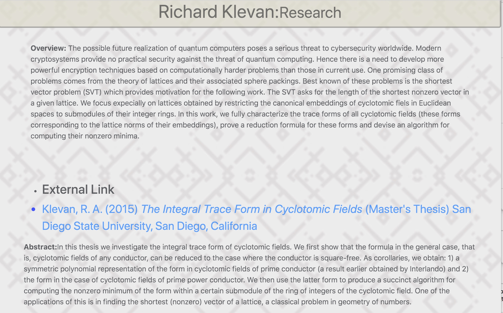
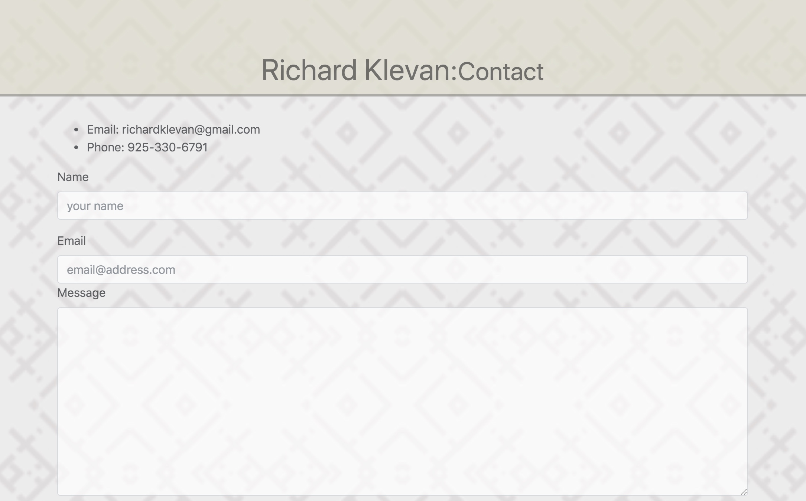

# Updated-Portfolio

### Table of Contents
- [Description](#Description)
- [Technologies-Libraries](#Technologies-Libraries)
- [Screenshots](#Screenshots)
- [Link](#Link)
​
### Description
a weather dashboard application with search functionality to find current weather conditions and the future weather outlook for multiple cities
​
### Technologies-Libraries
- [Bootstrap](https://getbootstrap.com/) - CSS Framework
- [JQuery](https://jquery.com/)

​
### Screenshots
​
​
​
​

​
### Link
https://raklevan.github.io/updated-portfolio/

